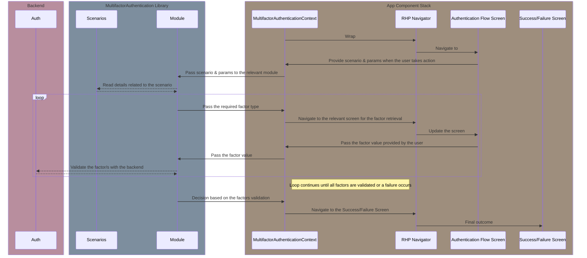
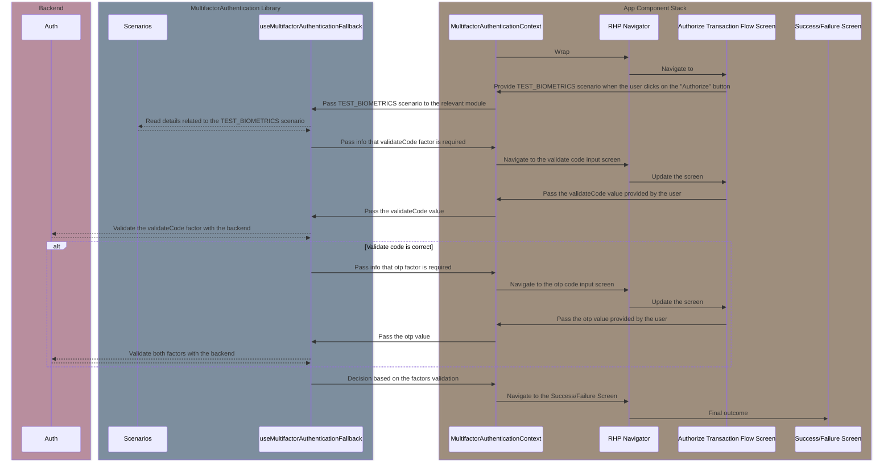
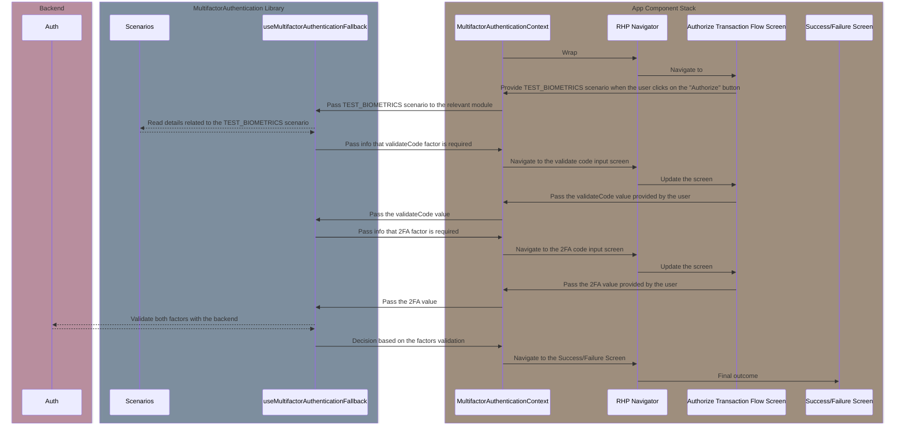
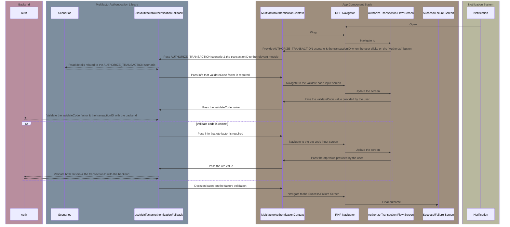
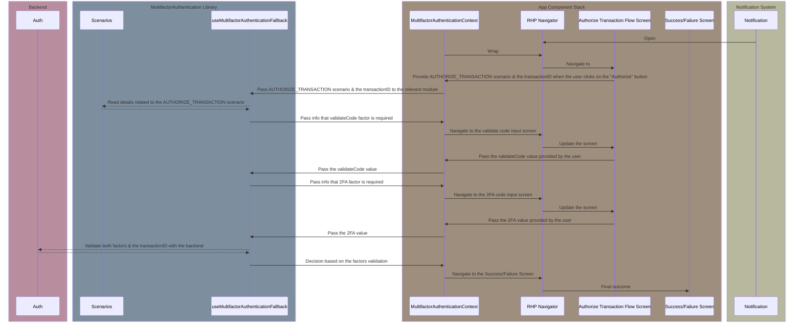

**GENERIC:**

```mermaid
sequenceDiagram
    box rgba(150,66,99,0.5) Backend
        participant Server as Auth
    end

    box rgba(33,66,99,0.5) MultifactorAuthentication Library
        participant SC as Scenarios
        participant Module as Module
    end

    box rgba(99,66,33,0.5) App Component Stack
        participant MFACTX as MultifactorAuthenticationContext
        participant RHPRHP as RHP Navigator
        participant Screen as Authentication Flow Screen
        participant Final as Success/Failure Screen
    end

    MFACTX->>RHPRHP: Wrap
    RHPRHP->>Screen: Navigate to
    Screen->>MFACTX: Provide scenario & params when the user takes action
    MFACTX->>Module: Pass scenario & params to the relevant module
    Module-->>SC: Read details related to the scenario
    SC-->>Module: ;
    loop
        Module->>MFACTX: Pass the required factor type
        MFACTX->>RHPRHP: Navigate to the relevant screen for the factor retrieval
        RHPRHP->>Screen: Update the screen
        Screen->>MFACTX: Pass the factor value provided by the user
        MFACTX->>Module: Pass the factor value
        Module-->>Server: Validate the factor/s with the backend
        Server-->>Module: ;
    end
    Note left of RHPRHP: Loop continues until all factors are validated or a failure occurs
    Module->>MFACTX: Decision based on the factors validation
    MFACTX->>RHPRHP: Navigate to the Success/Failure Screen
    RHPRHP->>Final: Final outcome
```

**TEST_BIOMETRICS:**

```mermaid
sequenceDiagram
    box rgba(150,66,99,0.5) Backend
        participant Server as Auth
    end

    box rgba(33,66,99,0.5) MultifactorAuthentication Library
        participant SC as Scenarios
        participant Module as useMultifactorAuthenticationFallback
    end

    box rgba(99,66,33,0.5) App Component Stack
        participant MFACTX as MultifactorAuthenticationContext
        participant RHPRHP as RHP Navigator
        participant Screen as Authorize Transaction Flow Screen
        participant Final as Success/Failure Screen
    end

    MFACTX->>RHPRHP: Wrap
    RHPRHP->>Screen: Navigate to
    Screen->>MFACTX: Provide TEST_BIOMETRICS scenario when the user clicks on the "Authorize" button
    MFACTX->>Module: Pass TEST_BIOMETRICS scenario to the relevant module
    Module-->>SC: Read details related to the TEST_BIOMETRICS scenario
    SC-->>Module: ;
    Module->>MFACTX: Pass info that validateCode factor is required
    MFACTX->>RHPRHP: Navigate to the validate code input screen
    RHPRHP->>Screen: Update the screen
    Screen->>MFACTX: Pass the validateCode value provided by the user
    MFACTX->>Module: Pass the validateCode value
    Module-->>Server: Validate the validateCode factor with the backend
    Server-->>Module: ;
    alt Validate code is correct
        Module->>MFACTX: Pass info that otp factor is required
        MFACTX->>RHPRHP: Navigate to the otp code input screen
        RHPRHP->>Screen: Update the screen
        Screen->>MFACTX: Pass the otp value provided by the user
        MFACTX->>Module: Pass the otp value
        Module-->>Server: Validate both factors with the backend
        Server-->>Module: ;
    end
    Module->>MFACTX: Decision based on the factors validation
    MFACTX->>RHPRHP: Navigate to the Success/Failure Screen
    RHPRHP->>Final: Final outcome
```

```mermaid
sequenceDiagram
    box rgba(150,66,99,0.5) Backend
        participant Server as Auth
    end

    box rgba(33,66,99,0.5) MultifactorAuthentication Library
        participant SC as Scenarios
        participant Module as useMultifactorAuthenticationFallback
    end

    box rgba(99,66,33,0.5) App Component Stack
        participant MFACTX as MultifactorAuthenticationContext
        participant RHPRHP as RHP Navigator
        participant Screen as Authorize Transaction Flow Screen
        participant Final as Success/Failure Screen
    end

    MFACTX->>RHPRHP: Wrap
    RHPRHP->>Screen: Navigate to
    Screen->>MFACTX: Provide TEST_BIOMETRICS scenario when the user clicks on the "Authorize" button
    MFACTX->>Module: Pass TEST_BIOMETRICS scenario to the relevant module
    Module-->>SC: Read details related to the TEST_BIOMETRICS scenario
    SC-->>Module: ;
    Module->>MFACTX: Pass info that validateCode factor is required
    MFACTX->>RHPRHP: Navigate to the validate code input screen
    RHPRHP->>Screen: Update the screen
    Screen->>MFACTX: Pass the validateCode value provided by the user
    MFACTX->>Module: Pass the validateCode value
    Module->>MFACTX: Pass info that 2FA factor is required
    MFACTX->>RHPRHP: Navigate to the 2FA code input screen
    RHPRHP->>Screen: Update the screen
    Screen->>MFACTX: Pass the 2FA value provided by the user
    MFACTX->>Module: Pass the 2FA value
    Module-->>Server: Validate both factors with the backend
    Server-->>Module: ;
    Module->>MFACTX: Decision based on the factors validation
    MFACTX->>RHPRHP: Navigate to the Success/Failure Screen
    RHPRHP->>Final: Final outcome
```

**AUTHORIZE_TRANSACTION:**

```mermaid
sequenceDiagram
        
    box rgba(150,66,99,0.5) Backend
        participant Server as Auth
    end

    box rgba(33,66,99,0.5) MultifactorAuthentication Library
        participant SC as Scenarios
        participant Module as useMultifactorAuthenticationFallback
    end

    box rgba(99,66,33,0.5) App Component Stack
        participant MFACTX as MultifactorAuthenticationContext
        participant RHPRHP as RHP Navigator
        participant Screen as Authorize Transaction Flow Screen
        participant Final as Success/Failure Screen
    end

    box rgba(150,150,99,0.5) Notification System
        participant Notification as Notification
    end

    Notification->>RHPRHP: Open
    MFACTX->>RHPRHP: Wrap
    RHPRHP->>Screen: Navigate to
    Screen->>MFACTX: Provide AUTHORIZE_TRANSACTION scenario & the transactionID when the user clicks on the "Authorize" button
    MFACTX->>Module: Pass AUTHORIZE_TRANSACTION scenario & the transactionID to the relevant module
    Module-->>SC: Read details related to the AUTHORIZE_TRANSACTION scenario
    SC-->>Module: ;
    Module->>MFACTX: Pass info that validateCode factor is required
    MFACTX->>RHPRHP: Navigate to the validate code input screen
    RHPRHP->>Screen: Update the screen
    Screen->>MFACTX: Pass the validateCode value provided by the user
    MFACTX->>Module: Pass the validateCode value
    Module-->>Server: Validate the validateCode factor & the transactionID with the backend
    Server-->>Module: ;
    alt Validate code is correct
        Module->>MFACTX: Pass info that otp factor is required
        MFACTX->>RHPRHP: Navigate to the otp code input screen
        RHPRHP->>Screen: Update the screen
        Screen->>MFACTX: Pass the otp value provided by the user
        MFACTX->>Module: Pass the otp value
        Module-->>Server: Validate both factors & the transactionID with the backend
        Server-->>Module: ;
    end
    Module->>MFACTX: Decision based on the factors validation
    MFACTX->>RHPRHP: Navigate to the Success/Failure Screen
    RHPRHP->>Final: Final outcome
```

```mermaid
sequenceDiagram
    box rgba(150,66,99,0.5) Backend
        participant Server as Auth
    end

    box rgba(33,66,99,0.5) MultifactorAuthentication Library
        participant SC as Scenarios
        participant Module as useMultifactorAuthenticationFallback
    end

    box rgba(99,66,33,0.5) App Component Stack
        participant MFACTX as MultifactorAuthenticationContext
        participant RHPRHP as RHP Navigator
        participant Screen as Authorize Transaction Flow Screen
        participant Final as Success/Failure Screen
    end

    box rgba(150,150,99,0.5) Notification System
        participant Notification as Notification
    end

    Notification->>RHPRHP: Open
    MFACTX->>RHPRHP: Wrap
    RHPRHP->>Screen: Navigate to
    Screen->>MFACTX: Provide AUTHORIZE_TRANSACTION scenario & the transactionID when the user clicks on the "Authorize" button
    MFACTX->>Module: Pass AUTHORIZE_TRANSACTION scenario & the transactionID to the relevant module
    Module-->>SC: Read details related to the AUTHORIZE_TRANSACTION scenario
    SC-->>Module: ;
    Module->>MFACTX: Pass info that validateCode factor is required
    MFACTX->>RHPRHP: Navigate to the validate code input screen
    RHPRHP->>Screen: Update the screen
    Screen->>MFACTX: Pass the validateCode value provided by the user
    MFACTX->>Module: Pass the validateCode value
    Module->>MFACTX: Pass info that 2FA factor is required
    MFACTX->>RHPRHP: Navigate to the 2FA code input screen
    RHPRHP->>Screen: Update the screen
    Screen->>MFACTX: Pass the 2FA value provided by the user
    MFACTX->>Module: Pass the 2FA value
    Module-->>Server: Validate both factors & the transactionID with the backend
    Server-->>Module: ;
    Module->>MFACTX: Decision based on the factors validation
    MFACTX->>RHPRHP: Navigate to the Success/Failure Screen
    RHPRHP->>Final: Final outcome
```