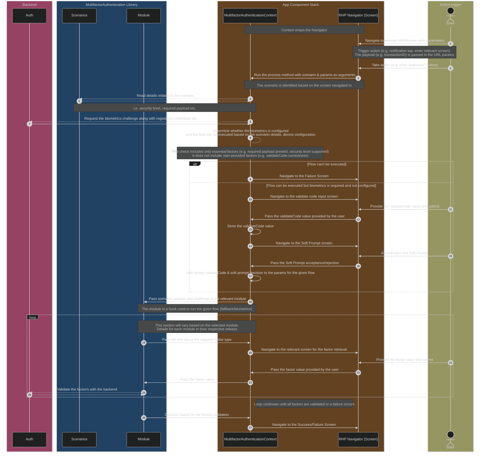
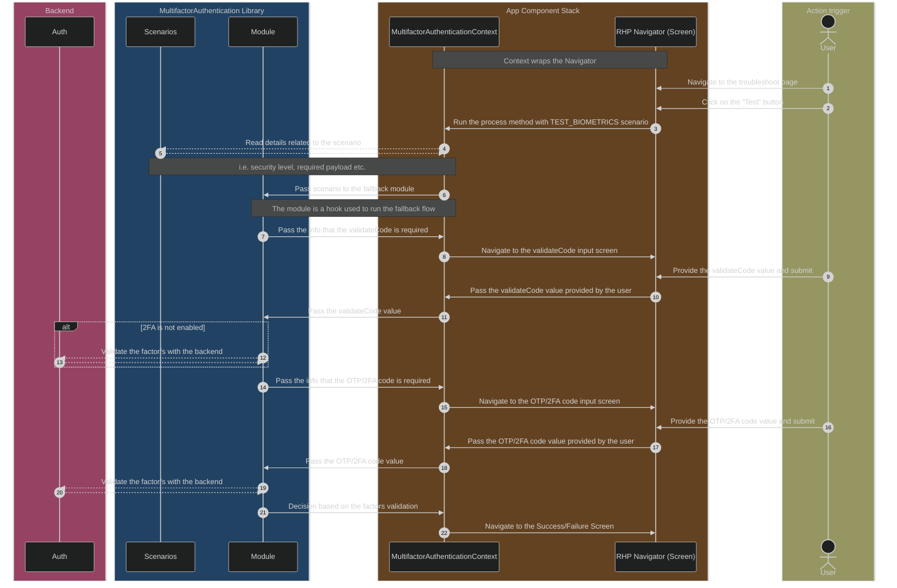
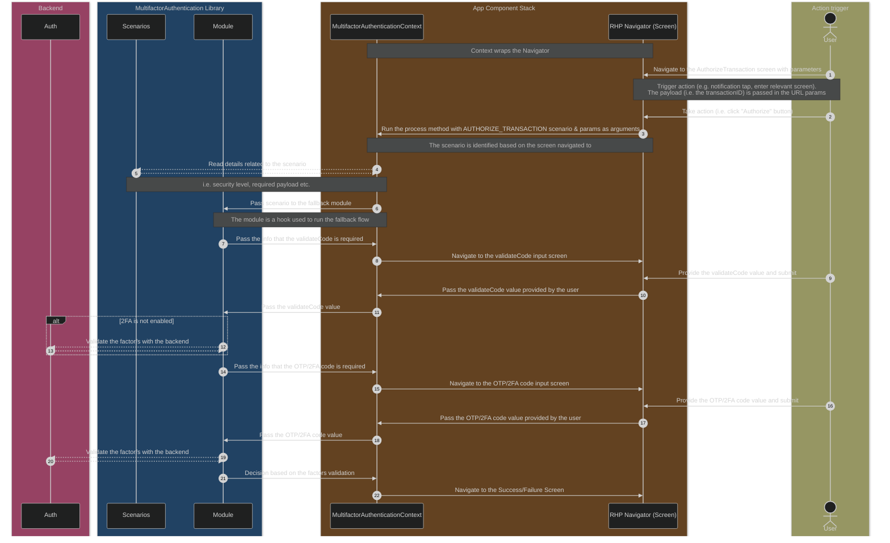
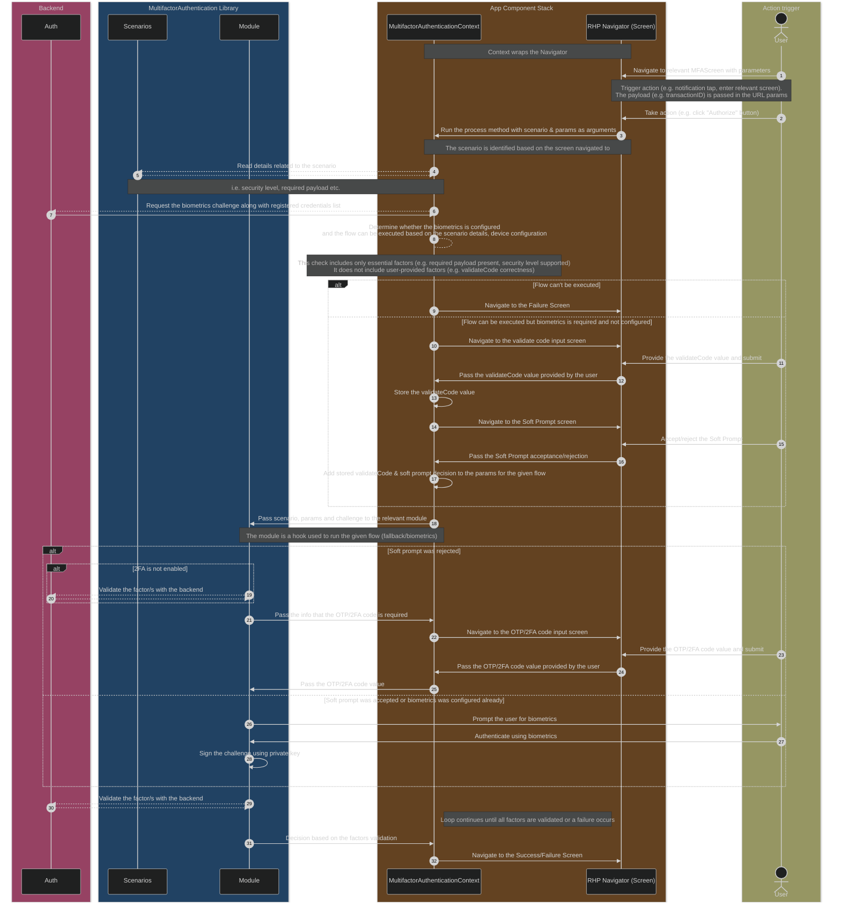
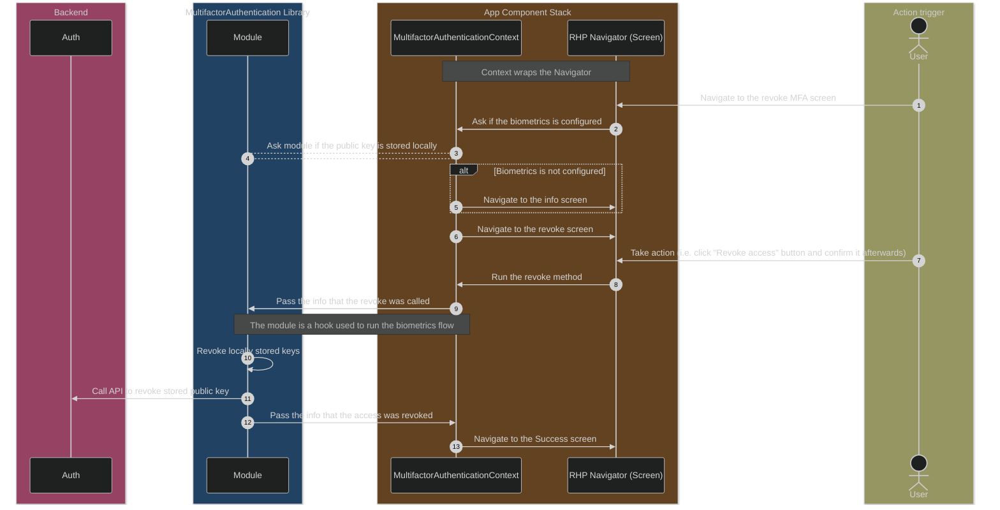

GENERIC:



**RELEASE ONE:**



**RELEASE_TWO:**



**RELEASE_THREE:**



**RELEASE_FOUR:**



```bash
src/
├── components/
│   └── MultifactorAuthenticationContext/
│       ├── scenarios.ts
│       ├── index.tsx
│       └── ... (helpers, types etc.)
├── hooks/
│   └── MultifactorAuthentication/
│       ├── useFallback.ts
│       ├── useNativeBiometrics/
│       │   ├── index.ts
│       │   └── useSetup.ts (internal hook)
│       ├── usePasskeysBiometrics.ts
│       └── ... (helpers, types etc.)
└── libs/
    └── MultifactorAuthentication/
        ├── Passkeys/
        │   └── ... 
        └── Biometrics/
            ├── SecureStore.ts
            ├── SecureStore.desktop.ts
            └── ...
```
