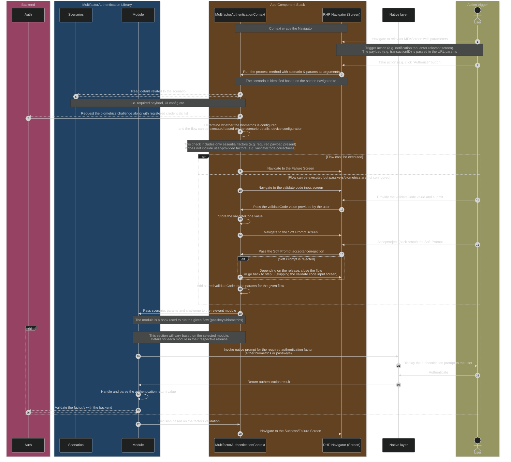
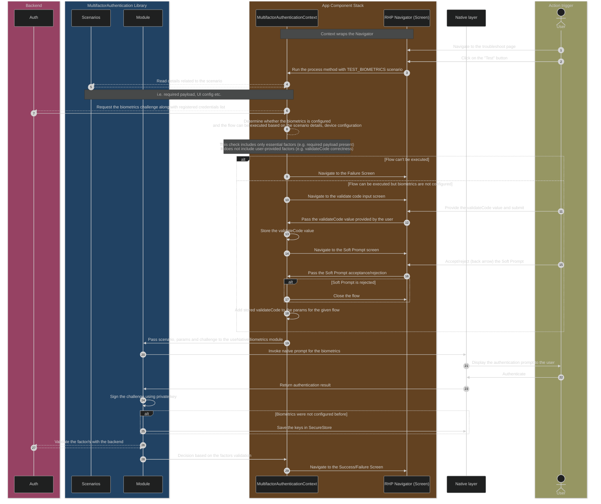
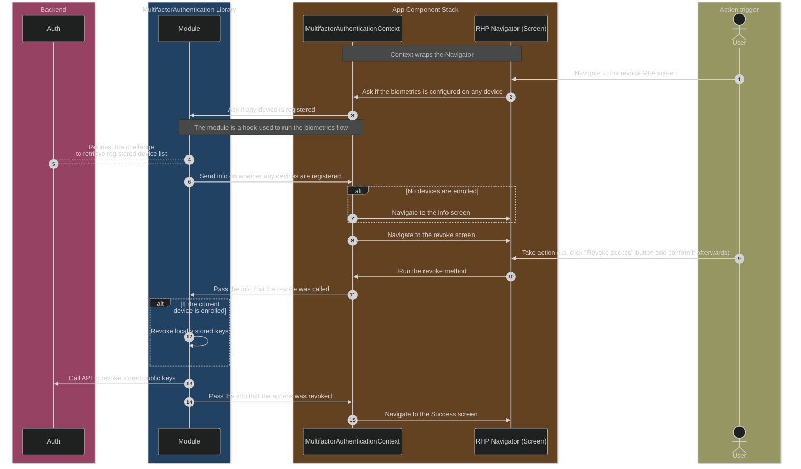
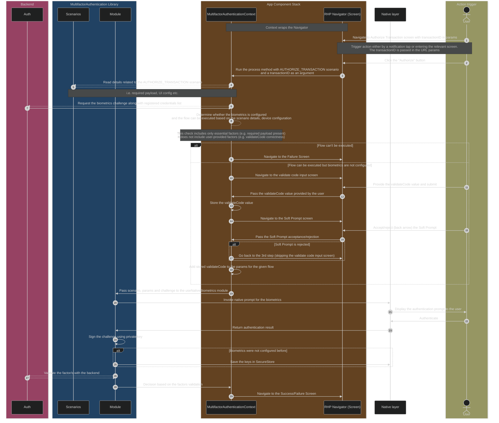

GENERIC:


```mermaid
---
config:
  theme: dark
---
sequenceDiagram
    autonumber
    box rgba(150,66,99,1) Backend
        participant Server as Auth
    end

    box rgba(33,66,99,1) MultifactorAuthentication Library
        participant SC as Scenarios
        participant Module as Module
    end

    box rgba(99,66,33,1) App Component Stack
        participant MFACTX as MultifactorAuthenticationContext
        participant RHPRHP as RHP Navigator (Screen)
    end

    participant NL as Native layer

    box rgba(150,150,99,1) Action trigger
        actor User
    end

    Note over MFACTX,RHPRHP: Context wraps the Navigator
    User->>RHPRHP: Navigate to relevant MFAScreen with parameters
    Note over User,RHPRHP: Trigger action (e.g. notification tap, enter relevant screen).<br />The payload (e.g. transactionID) is passed in the URL params
    User->>RHPRHP: Take action (e.g. click "Authorize" button)
    RHPRHP->>MFACTX: Run the process method with scenario & params as arguments
        Note over RHPRHP,MFACTX: The scenario is identified based on the screen navigated to
    MFACTX-->>SC: Read details related to the scenario
    SC-->>MFACTX: ;
        Note over MFACTX,SC: i.e. required payload, UI config etc.
    MFACTX-->>Server: Request the biometrics challenge along with registered credentials list
    Server->>MFACTX: ;
    MFACTX-->MFACTX: Determine whether the biometrics is configured<br /> and the flow can be executed based on the scenario details, device configuration
        Note over MFACTX: This check includes only essential factors (e.g. required payload present) <br /> It does not include user-provided factors (e.g. validateCode correctness)
    alt Flow can't be executed
        MFACTX->>RHPRHP: Navigate to the Failure Screen
    else Flow can be executed but passkeys/biometrics are not configured
        MFACTX->>RHPRHP: Navigate to the validate code input screen
        User->>RHPRHP: Provide the validateCode value and submit
        RHPRHP->>MFACTX: Pass the validateCode value provided by the user
        MFACTX->>MFACTX: Store the validateCode value
        MFACTX->>RHPRHP: Navigate to the Soft Prompt screen
        User->>RHPRHP: Accept/reject (back arrow) the Soft Prompt
        RHPRHP->>MFACTX: Pass the Soft Prompt acceptance/rejection
        alt Soft Prompt is rejected
            MFACTX->>RHPRHP: Depending on the release, close the flow <br />or go back to step 3 (skipping the validate code input screen)
        end
        MFACTX->>MFACTX: Add stored validateCode to the params for the given flow
    end
    MFACTX->>Module: Pass scenario, params and challenge to the relevant module
        Note over MFACTX,Module: The module is a hook used to run the given flow (passkeys/biometrics)
    critical
        Note over Module,MFACTX: This section will vary based on the selected module.<br />Details for each module in their respective release
        Module->>NL: Invoke native prompt for the required authentication factor<br />(either biometrics or passkeys)
        NL->>User: Display the authentication prompt to the user
        User->>NL: Authenticate
        NL->>Module: Return authentication result
        Module->>Module: Handle and parse the authentication return value
        Module-->>Server: Validate the factor/s with the backend
        Server-->>Module: ;
    end

    Module->>MFACTX: Decision based on the factors validation
    MFACTX->>RHPRHP: Navigate to the Success/Failure Screen
```

**RELEASE ONE:**


```mermaid
---
config:
  theme: dark
---
sequenceDiagram
    autonumber
    box rgba(150,66,99,1) Backend
        participant Server as Auth
    end

    box rgba(33,66,99,1) MultifactorAuthentication Library
        participant SC as Scenarios
        participant Module as Module
    end

    box rgba(99,66,33,1) App Component Stack
        participant MFACTX as MultifactorAuthenticationContext
        participant RHPRHP as RHP Navigator (Screen)
    end

    participant NL as Native layer

    box rgba(150,150,99,1) Action trigger
        actor User
    end

    Note over MFACTX,RHPRHP: Context wraps the Navigator
    User->>RHPRHP: Navigate to the troubleshoot page
    User->>RHPRHP: Click on the "Test" button
    RHPRHP->>MFACTX: Run the process method with TEST_BIOMETRICS scenario
    MFACTX-->>SC: Read details related to the scenario
    SC-->>MFACTX: ;
        Note over MFACTX,SC: i.e. required payload, UI config etc.
    MFACTX-->>Server: Request the biometrics challenge along with registered credentials list
    Server->>MFACTX: ;
    MFACTX-->MFACTX: Determine whether the biometrics is configured<br /> and the flow can be executed based on the scenario details, device configuration
        Note over MFACTX: This check includes only essential factors (e.g. required payload present) <br /> It does not include user-provided factors (e.g. validateCode correctness)
    alt Flow can't be executed
        MFACTX->>RHPRHP: Navigate to the Failure Screen
    else Flow can be executed but biometrics are not configured
        MFACTX->>RHPRHP: Navigate to the validate code input screen
        User->>RHPRHP: Provide the validateCode value and submit
        RHPRHP->>MFACTX: Pass the validateCode value provided by the user
        MFACTX->>MFACTX: Store the validateCode value
        MFACTX->>RHPRHP: Navigate to the Soft Prompt screen
        User->>RHPRHP: Accept/reject (back arrow) the Soft Prompt
        RHPRHP->>MFACTX: Pass the Soft Prompt acceptance/rejection
        alt Soft Prompt is rejected
            MFACTX->>RHPRHP: Close the flow
        end
        MFACTX->>MFACTX: Add stored validateCode to the params for the given flow
    end
    MFACTX->>Module: Pass scenario, params and challenge to the useNativeBiometrics module
    Module->>NL: Invoke native prompt for the biometrics
    NL->>User: Display the authentication prompt to the user
    User->>NL: Authenticate
    NL->>Module: Return authentication result
    Module->>Module: Sign the challenge using private key
    alt Biometrics were not configured before
        Module->>NL: Save the keys in SecureStore
    end
    Module-->>Server: Validate the factor/s with the backend
    Server-->>Module: ;
    Module->>MFACTX: Decision based on the factors validation
    MFACTX->>RHPRHP: Navigate to the Success/Failure Screen
```

**RELEASE TWO:**


```mermaid
---
config:
  theme: dark
---
sequenceDiagram
    autonumber
    box rgba(150,66,99,1) Backend
        participant Server as Auth
    end


    box rgba(33,66,99,1) MultifactorAuthentication Library
        participant Module as Module
    end

    box rgba(99,66,33,1) App Component Stack
        participant MFACTX as MultifactorAuthenticationContext
        participant RHPRHP as RHP Navigator (Screen)
    end


    box rgba(150,150,99,1) Action trigger
        actor User
    end


    Note over MFACTX,RHPRHP: Context wraps the Navigator
    User->>RHPRHP: Navigate to the revoke MFA screen
    RHPRHP->>MFACTX: Ask if the biometrics is configured on any device
    MFACTX->>Module: Ask if any device is registered
        Note over MFACTX,Module: The module is a hook used to run the biometrics flow
    Module-->Server: Request the challenge<br/> to retrieve registered device list
    Server-->Module: ;
    Module->>MFACTX: Send info on whether any devices are registered
    alt No devices are enrolled
        MFACTX->>RHPRHP: Navigate to the info screen
    end
    MFACTX->>RHPRHP: Navigate to the revoke screen
    User->>RHPRHP: Take action (i.e. click "Revoke access" button and confirm it afterwards)
    RHPRHP->>MFACTX: Run the revoke method
    MFACTX->>Module: Pass the info that the revoke was called
    alt If the current device is enrolled
    Module->>Module: Revoke locally stored keys
    end
        Module->>Server: Call API to revoke stored public keys
    Module->>MFACTX: Pass the info that the access was revoked
    MFACTX->>RHPRHP: Navigate to the Success screen
```

**RELEASE THREE:**


```mermaid
---
config:
  theme: dark
---
sequenceDiagram
    autonumber
    box rgba(150,66,99,1) Backend
        participant Server as Auth
    end

    box rgba(33,66,99,1) MultifactorAuthentication Library
        participant SC as Scenarios
        participant Module as Module
    end

    box rgba(99,66,33,1) App Component Stack
        participant MFACTX as MultifactorAuthenticationContext
        participant RHPRHP as RHP Navigator (Screen)
    end

    participant NL as Native layer

    box rgba(150,150,99,1) Action trigger
        actor User
    end

    Note over MFACTX,RHPRHP: Context wraps the Navigator
        User->>RHPRHP: Navigate to Authorize Transaction screen with transactionID in params
    Note over User,RHPRHP: Trigger action either by a notification tap or entering the relevant screen.<br />The transactionID is passed in the URL params
    User->>RHPRHP: Click the "Authorize" button
    RHPRHP->>MFACTX: Run the process method with AUTHORIZE_TRANSACTION scenario<br /> and a transactionID as an argument
    MFACTX-->>SC: Read details related to the AUTHORIZE_TRANSACTION scenario
    SC-->>MFACTX: ;
    Note over MFACTX,SC: i.e. required payload, UI config etc.
    MFACTX-->>Server: Request the biometrics challenge along with registered credentials list
    Server->>MFACTX: ;
    MFACTX-->MFACTX: Determine whether the biometrics is configured<br /> and the flow can be executed based on the scenario details, device configuration
        Note over MFACTX: This check includes only essential factors (e.g. required payload present) <br /> It does not include user-provided factors (e.g. validateCode correctness)
    alt Flow can't be executed
        MFACTX->>RHPRHP: Navigate to the Failure Screen
    else Flow can be executed but biometrics are not configured
        MFACTX->>RHPRHP: Navigate to the validate code input screen
        User->>RHPRHP: Provide the validateCode value and submit
        RHPRHP->>MFACTX: Pass the validateCode value provided by the user
        MFACTX->>MFACTX: Store the validateCode value
        MFACTX->>RHPRHP: Navigate to the Soft Prompt screen
        User->>RHPRHP: Accept/reject (back arrow) the Soft Prompt
        RHPRHP->>MFACTX: Pass the Soft Prompt acceptance/rejection
        alt Soft Prompt is rejected
            MFACTX->>RHPRHP: Go back to the 3rd step (skipping the validate code input screen)
        end
        MFACTX->>MFACTX: Add stored validateCode to the params for the given flow
    end
    MFACTX->>Module: Pass scenario, params and challenge to the useNativeBiometrics module
    Module->>NL: Invoke native prompt for the biometrics
    NL->>User: Display the authentication prompt to the user
    User->>NL: Authenticate
    NL->>Module: Return authentication result
    Module->>Module: Sign the challenge using private key
    alt Biometrics were not configured before
        Module->>NL: Save the keys in SecureStore
    end
    Module-->>Server: Validate the factor/s with the backend
    Server-->>Module: ;
    Module->>MFACTX: Decision based on the factors validation
    MFACTX->>RHPRHP: Navigate to the Success/Failure Screen
```

```bash
src/
├── components/
│   └── MultifactorAuthentication/
│       ├── scenarios.ts
│       ├── MultifactorAuthenticationContext.tsx
│       ├── useNativeBiometrics/
│       │   ├── index.ts
│       │   └── useNativeBiometricsSetup.ts (internal hook)
│       ├── usePasskeysBiometrics/
│       │   ├── index.ts
│       │   └── ... (passkeys helpers)
│       ├── useMultifactorAuthenticationStatus.ts (helper)
│       └── ... (helpers, types etc.)
└── libs/
    └── MultifactorAuthentication/
        └── Biometrics/
            ├── SecureStore.ts
            └── ...
```
